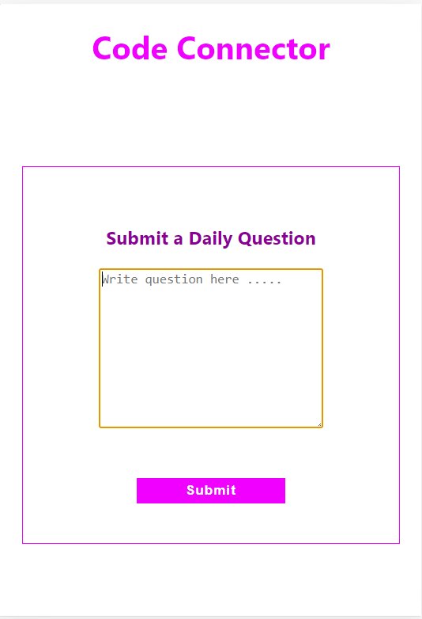
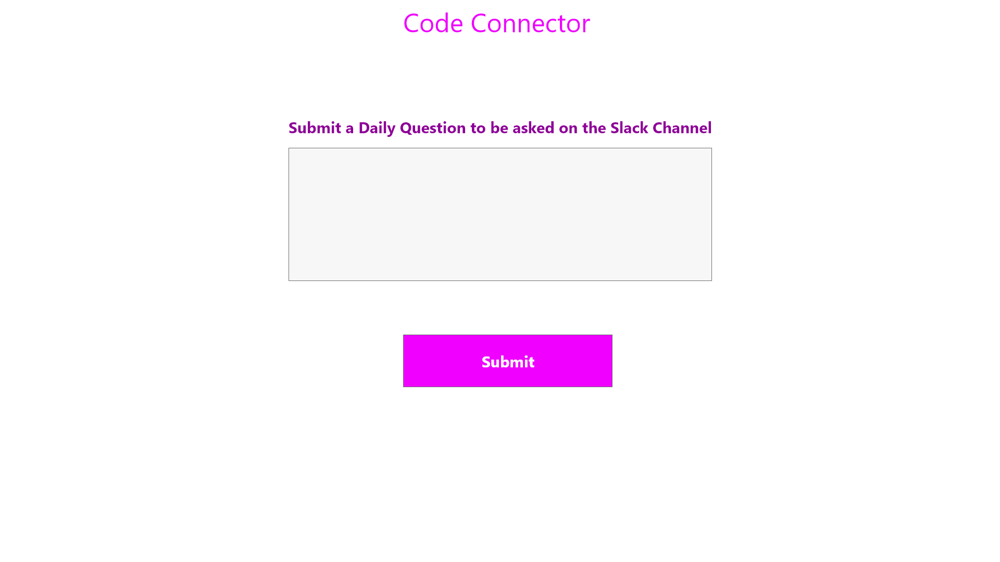

# Code Connection Submit a Question Form

;

### Table of Contents
1. Purpose
2. Motivation
5. Click to View Site
3. Objectives
4. Wireframe
5. Technologies Used

### Purpose:
Allow members of the tech non-profit group to submit quesitons to be posted in the morning on Slack.

### Motivation:

This project was used to practice developing an API with Netlify Functions and connecting to a Airtable.com database.

### Click to view Site [Question Submission Form](https://code-connector-question-submission.netlify.app/)

### Objectives:
1. User can input an question.
2. The user inputted question is saved to an Airtable.com database utilizing a Netlify function    
3. The user is informed that the question has been saved
4. There is an API to display all questions

### WireFrame

### This app was built with the following technologies:

**React:** JavaScript front-end library for building user interfaces

**Netlify**: Web developer platform for hosting infrastructure, continuous integration, deployment pipeline with GitHub, and serverless backend services.

**Airtable** Web developer platform with a spreadsheet-database hybrid that allow users to access to data.

**Git-Hub:** Web-based version control repository and Internet hosting service

**Abode XD** A wire-framing tool used to create a mockup/visual of what is to be coded

**JavaScript:** Object-oriented programming language for web pages

**HTML:** Mark-up language for creating web pages

**CSS:** A formatting language for styling web pages

_Created by JC Smiley in July of 2020_